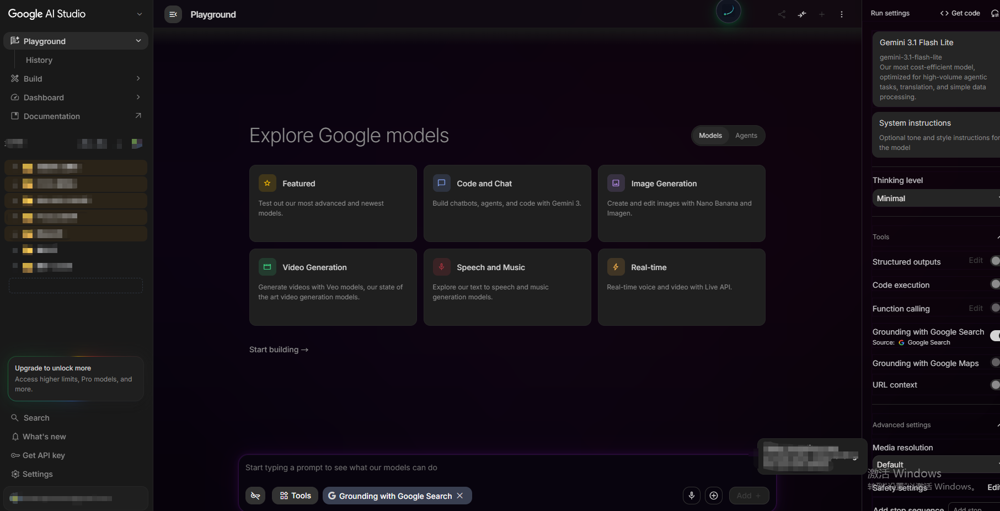

# 🪞 Google AI Studio: Reimagined
### 高保真界面重塑计划 · 极简生产力方案

  
  
  

---

<!-- 这里是核心大图展示区 -->
 

  

 

---

## 📑 核心设计理念 (Design Philosophy)

> **"不仅仅是美化，更是为了更专注的对话体验。"**
>
> 我们通过对 Google AI Studio 的 DOM 结构进行深度解析，去除了冗余的视觉干扰，优化了排版对比度，使之更接近于一个专业的 IDE 开发环境。

 

## ✨ 视觉进化亮点 (Key Enhancements)

<table>
  <tr>
    <td width="50%">
      <h3>🚀 极致布局</h3>
      
重新定义侧边栏与主舞台的黄金分割比例，增加内容呼吸感，即使在长时间对话下也能保持视觉舒适。

    </td>
    <td width="50%">
      <h3>💻 开发者友好</h3>
      
针对 Markdown 代码块进行像素级微调，增强语法高亮对比度，采用更易读的等宽字体渲染。

    </td>
  </tr>
  <tr>
    <td width="50%">
      <h3>🎨 专注焦点</h3>
      
输入框焦点态增强，弱化非活动组件，帮助用户更快速地锁定当前正在进行的任务。

    </td>
    <td width="50%">
      <h3>🌑 深度暗色模式</h3>
      
修复原生模式下的灰度色差，采用更加深邃、护眼的色值体系，降低蓝光伤害。

    </td>
  </tr>
</table>

 

## 🛠️ 快速部署 (Setup)

本项目基于 **Stylus** 引擎开发，只需三步即可完成进化：

1. **获取工具**：安装浏览器插件 [Stylus](https://add0n.com/stylus.html)。
2. **导入源码**：在管理面板点击 `编写新样式`。
3. **注入配置**：将仓库中的 `Google-AI-Studio.css` 内容粘贴并保存。

---

## 👨‍💻 维护者 (Maintainer)
**METAXGTSEOSEM**  
如果您喜欢这个设计，请点一个 **Star** ⭐️ 

[MIT License](./LICENSE) © 2026

