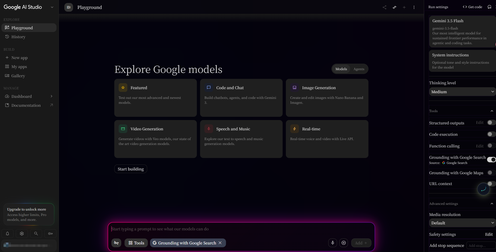

<div align="center">

<br />

# 🎨 Google AI Studio — Reimagined

### Premium CSS Overrides · Aesthetic + Productivity · 3 Gorgeous Themes

<br />

<p>
  
  
  
  
  
</p>

<br />

---

<br />

## 🌈 Choose Your Vibe

> Three radically different themes. One mission: make Google AI Studio *yours*.

<br />

</div>

<!-- ═══════════════════════════════════════════════════ -->
<!-- THEME 1 — ORIGINAL PRO                              -->
<!-- ═══════════════════════════════════════════════════ -->
<table style="width:100%; border-collapse: separate; border-spacing: 0 24px;">
<tr>
<td style="border-radius: 32px; padding: 32px 28px; background: linear-gradient(145deg, #080c1a 0%, #10172e 50%, #0a0f20 100%); border: 2px solid #3b5998; box-shadow: 0 8px 48px rgba(59,89,152,0.2), inset 0 1px 0 rgba(255,255,255,0.04);">

<table style="width:100%;">
<tr>
<td width="60%" style="vertical-align: top; padding-right: 24px;">

### 🖥️ Original Pro
###### The definitive clean-IDE aesthetic

<br />

A surgical CSS overhaul that transforms Google AI Studio into a dark, distraction-free IDE. Pixel-level tuned — no bloat, just polish.

<br />

**What it does:**
- 🧹 Strips visual noise & redundant chrome
- 🎯 Rebalanced golden-ratio layout between sidebar & stage
- 🖤 Deep OLED-friendly dark palette — less eye strain
- 📝 Enhanced Markdown code blocks with improved syntax contrast
- ⌨️ Amplified input-focus state for flow-state work
- 🔲 Monospace rendering tuned for long conversation reads

<br />

**Install via Stylus**
1. Install [Stylus](https://add0n.com/stylus.html) extension
2. Open Stylus panel → **"Write new style"**
3. Paste [Google-AI-Studio.css](./Google-AI-Studio.css) → Save
4. Visit [Google AI Studio](https://aistudio.google.com/) ✨

</td>
<td width="40%" align="center" style="vertical-align: middle;">


</td>
</tr>
</table>

</td>
</tr>

<!-- ═══════════════════════════════════════════════════ -->
<!-- THEME 2 — DEEP INDIGO & PLUM                        -->
<!-- ═══════════════════════════════════════════════════ -->
<tr>
<td style="border-radius: 32px; padding: 32px 28px; background: linear-gradient(145deg, #07050e 0%, #110b20 50%, #0a0615 100%); border: 2px solid #5b4a9e; box-shadow: 0 8px 48px rgba(91,74,158,0.25), inset 0 1px 0 rgba(255,255,255,0.04);">

<table style="width:100%;">
<tr>
<td width="60%" style="vertical-align: top; padding-right: 24px;">

### 🌌 Deep Indigo & Plum
###### Starry cosmic gradient · Serene depth

<br />

A slow-breathing cosmic atmosphere for your AI conversations. Deep indigo drifts into shadowy plum across the page — calm, immersive, and endlessly deep.

<br />

**What it does:**
- 🌠 Animated radial-gradient background — 20s breathing cycle
- 🫧 Full transparency pass on all containers — gradient bleeds through
- 🌀 Glass-morphism sidebar & toolbar with backdrop blur
- 💜 Muted plum-accent buttons, dropdowns & scrollbars
- 🌙 Ultra-dark card interiors for thought panels
- 🎭 Coexists perfectly with the Original Pro theme elements

<br />

**Install via Stylus**
1. Install [Stylus](https://add0n.com/stylus.html) extension
2. Open Stylus panel → **"Write new style"**
3. Paste [Google-AI-Studio-Deep-Indigo-Plum.css](./Google-AI-Studio-Deep-Indigo-Plum.css) → Save
4. Visit [Google AI Studio](https://aistudio.google.com/) 🌠

</td>
<td width="40%" align="center" style="vertical-align: middle;">


</td>
</tr>
</table>

</td>
</tr>

<!-- ═══════════════════════════════════════════════════ -->
<!-- THEME 3 — PINK-PURPLE NEON                          -->
<!-- ═══════════════════════════════════════════════════ -->
<tr>
<td style="border-radius: 32px; padding: 32px 28px; background: linear-gradient(145deg, #0c0418 0%, #160927 50%, #0e051a 100%); border: 2px solid #c0268c; box-shadow: 0 8px 48px rgba(192,38,140,0.3), inset 0 1px 0 rgba(255,255,255,0.04);">

<table style="width:100%;">
<tr>
<td width="60%" style="vertical-align: top; padding-right: 24px;">

### 💖 Pink-Purple Neon
###### Electric glow · Ultra-bright input · Neon dream

<br />

The boldest theme in the collection. A luminous pink-to-purple gradient input box that pulses with neon energy — surrounded by a deep noir backdrop. Built for those who want their AI Studio to *glow*.

<br />

**What it does:**
- ⚡ Gradient-border input box with neon pink → violet
- 💫 Animated glow shadow that pulses in an 8s breathing loop
- ✨ Hover & focus states that intensify glow to retina-searing levels
- 💗 Hot-pink caret inside the textarea
- 🌑 Deep noir base with 3-layer radial gradient atmosphere
- 🎯 Full glass-morphism on cards, panels, dropdowns & sidebars

<br />

> ⚠️ **Requires a Userscript Manager** — this theme ships as a .user.js file, not plain CSS.
> Install **Tampermonkey** or **Violentmonkey** first:
>
> [](https://www.tampermonkey.net/)
> [](https://violentmonkey.github.io/)

<br />

**Install via Tampermonkey**
1. Install [Tampermonkey](https://www.tampermonkey.net/) (or Violentmonkey)
2. Click the Tampermonkey icon → **"Create a new script"**
3. Paste [Google-AI-Studio-Deep-Indigo-Plum.user.js](./Google-AI-Studio-Deep-Indigo-Plum.user.js) → Save
4. Visit [Google AI Studio](https://aistudio.google.com/) 💖 — theme auto-applies!

</td>
<td width="40%" align="center" style="vertical-align: middle;">



</td>
</tr>
</table>

</td>
</tr>
</table>

<br />

<div align="center">

---

<br />

## 🎯 Design Philosophy

<br />

<table style="width:90%;">
<tr>
<td align="center" style="padding: 20px 16px;">

> *"Not decoration — **focus engineering**."*

</td>
</tr>
<tr>
<td style="padding: 16px 24px;">

Every rule in these stylesheets was written after deep DOM inspection of AI Studio's runtime markup. We don't just paint over the UI — we **remove visual noise**, **rebalance spatial proportions**, and **tune contrast ratios** so you can stay in flow longer without fatigue.

- **No library dependencies** — pure CSS overrides, zero runtime cost
- **No !important abuse** — every rule is scoped to the minimum specificity needed
- **Coexistence-first** — multiple themes can be active simultaneously via different extension profiles
- **Accessibility-conscious** — scrollbar styling, focus indicators, and contrast tuned for long sessions

</td>
</tr>
</table>

<br />

---

<br />

## ✨ Feature Matrix

<br />

<table style="width:90%; border-collapse: collapse; border-spacing: 0;">
<tr style="border-bottom: 1px solid rgba(255,255,255,0.1);">
<th align="left" style="padding: 12px 16px; font-size: 16px;">Feature</th>
<th align="center" style="padding: 12px 16px;">🖥️ Original Pro</th>
<th align="center" style="padding: 12px 16px;">🌌 Deep Indigo</th>
<th align="center" style="padding: 12px 16px;">💖 Neon</th>
</tr>
<tr style="border-bottom: 1px solid rgba(255,255,255,0.06);">
<td style="padding: 10px 16px;">Dark background</td>
<td align="center">✅</td>
<td align="center">✅</td>
<td align="center">✅</td>
</tr>
<tr style="border-bottom: 1px solid rgba(255,255,255,0.06);">
<td style="padding: 10px 16px;">Animated gradient bg</td>
<td align="center">—</td>
<td align="center">✅</td>
<td align="center">✅</td>
</tr>
<tr style="border-bottom: 1px solid rgba(255,255,255,0.06);">
<td style="padding: 10px 16px;">Glass-morphism panels</td>
<td align="center">—</td>
<td align="center">✅</td>
<td align="center">✅</td>
</tr>
<tr style="border-bottom: 1px solid rgba(255,255,255,0.06);">
<td style="padding: 10px 16px;">Neon input glow</td>
<td align="center">—</td>
<td align="center">—</td>
<td align="center">⚡</td>
</tr>
<tr style="border-bottom: 1px solid rgba(255,255,255,0.06);">
<td style="padding: 10px 16px;">Custom scrollbar</td>
<td align="center">—</td>
<td align="center">✅</td>
<td align="center">✅</td>
</tr>
<tr style="border-bottom: 1px solid rgba(255,255,255,0.06);">
<td style="padding: 10px 16px;">Markdown block tuning</td>
<td align="center">✅</td>
<td align="center">—</td>
<td align="center">—</td>
</tr>
<tr style="border-bottom: 1px solid rgba(255,255,255,0.06);">
<td style="padding: 10px 16px;">Layout proportion fix</td>
<td align="center">✅</td>
<td align="center">—</td>
<td align="center">—</td>
</tr>
<tr style="border-bottom: 1px solid rgba(255,255,255,0.06);">
<td style="padding: 10px 16px;">Hover feedback</td>
<td align="center">✅</td>
<td align="center">✅</td>
<td align="center">✅</td>
</tr>
<tr>
<td style="padding: 10px 16px; font-weight: bold;">Installation tool</td>
<td align="center">Stylus</td>
<td align="center">Stylus</td>
<td align="center">Tampermonkey</td>
</tr>
</table>

<br />

---

<br />

## 📦 Quick Install

<br />

| Theme | Tool | File |
|-------|------|------|
| 🖥️ **Original Pro** | [Stylus](https://add0n.com/stylus.html) | [Google-AI-Studio.css](./Google-AI-Studio.css) |
| 🌌 **Deep Indigo & Plum** | [Stylus](https://add0n.com/stylus.html) | [Google-AI-Studio-Deep-Indigo-Plum.css](./Google-AI-Studio-Deep-Indigo-Plum.css) |
| 💖 **Pink-Purple Neon** | [Tampermonkey](https://www.tampermonkey.net/) | [Google-AI-Studio-Deep-Indigo-Plum.user.js](./Google-AI-Studio-Deep-Indigo-Plum.user.js) |

<br />

> 💡 **Tip**: Use separate browser profiles (or different extension managers) to run multiple themes side by side for comparison!

<br />

---

<br />

## 📁 Repository Structure

<br />

```
Google-AI-Studio-CSS-UI/
├── Google-AI-Studio.css                          # Original Pro theme (Stylus)
├── Google-AI-Studio-Deep-Indigo-Plum.css          # Deep Indigo & Plum theme (Stylus)
├── Google-AI-Studio-Deep-Indigo-Plum.user.js      # Pink-Purple Neon theme (Tampermonkey)
├── assets/
│   ├── preview.png                                # Original Pro screenshot
│   ├── deep-indigo-plum-preview.png               # Deep Indigo screenshot
│   └── pink-purple-neon-preview.png               # Neon screenshot
├── README.md                                      # You are here
└── LICENSE                                        # MIT
```

<br />

---

<br />

## 👤 Maintainer

**METAXGTSEOSEM**

Found this useful? Drop a ⭐ [**Star**](https://github.com/METAXGTSEOSEM/Google-AI-Studio-CSS-UI) — it helps others discover these themes too!

<br />

[](./LICENSE)

<br />

</div>
